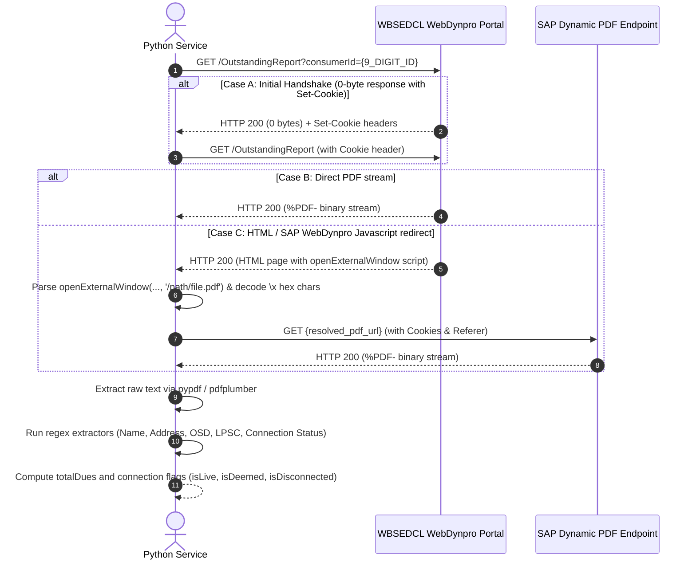

# Technical Specification & Integration Guide: Live OSD Scraping & PDF Extraction Service

This document explains the end-to-end architecture, SAP WebDynpro protocol quirks, URL reverse-engineering, network handshakes, PDF extraction, and regex parsing patterns used by the live OSD engine. It provides a complete, copy-paste ready Python implementation designed so an agency or backend engineering team can wire everything into any Python project in one go.

---

## 1. Architectural Overview & Workflow

The service queries the official WBSEDCL (West Bengal State Electricity Distribution Company Limited) portal to retrieve live Outstanding Dues (OSD) or "No Dues Certificate" reports in PDF format for any given 9-digit Consumer ID.



---

## 2. Protocol & Portal Quirks

### 2.1 The Entry URL
* **Base URL:**
  `https://portal.wbsedcl.in/webdynpro/resources/wbsedcl/noduesandoutstandingreport/OutstandingReport?consumerId={consumerId}`
* **Validation:** Consumer ID must be strictly a **9-digit numeric string** (`^\d{9}$`).

### 2.2 Quirk 1: The 0-Byte Cookie Handshake
When queried cold or when a new session is initiated, the SAP WebDynpro server occasionally returns an empty (`0 bytes`) HTTP 200 response alongside `Set-Cookie` session tokens.
* **Handling:** Check if `response.content` is empty. Preserve cookies across requests using an active `requests.Session` or `httpx.Client`, and retry the GET request immediately.

### 2.3 Quirk 2: WebDynpro JavaScript URL Encapsulation
If the server does not directly return the `%PDF-` binary stream, it renders an HTML page containing an SAP WebDynpro script call:
```javascript
openExternalWindow('sap_ctrl_id', '\x2fwebdynpro\x2fresources\x2f...\x2freport.pdf\x3f...', 0, 0, 0, 0, true, true, true, true)
```
* Note that `openExternalWindow` in SAP WebDynpro takes **up to 10 arguments**. A regex expecting a closing parenthesis `)` immediately after the URL will fail.
* The URL contains hex escape sequences such as:
  * `\x2f` -> `/`
  * `\x3f` -> `?`
  * `\x26` -> `&`
* It may also contain XML/HTML entity encodings (e.g., `&amp;` -> `&`).
* The extracted path is usually a relative URL (e.g. `/webdynpro/resources/...`). It must be resolved against the base URL `https://portal.wbsedcl.in/`.

### 2.4 Quirk 3: Headers & Referer Requirement
The portal requires browser-grade headers; bare programmatic user-agents (e.g. `python-requests/x.x`) can be throttled or blocked.
* Use a standard modern Chrome User-Agent.
* The PDF fetch request must include `Referer: https://portal.wbsedcl.in/...`.

---

## 3. PDF Content Extraction & Regex Specifications

Once the binary buffer starting with `%PDF-` is obtained, parse it to extract raw text and evaluate the following fields:

### 3.1 Document Type
* Check if text contains `NO DUES CERTIFICATE` -> `docType = "NO DUES CERTIFICATE"`
* Else if text contains `OUTSTANDING REPORT` -> `docType = "OUTSTANDING REPORT"`
* Otherwise -> `docType = "UNKNOWN"`

### 3.2 Metadata Fields
| Field | Regex Pattern | Description / Transformation |
| :--- | :--- | :--- |
| **Consumer Name** | `Name\s*:\s*(.+)` | Consumer full name |
| **Service Address** | `Service Location Address\s*:\s*([\s\S]*?)(?=Office Name\s*:)` | Multi-line string, collapse whitespace (`\s+`) to single spaces |
| **Office Name** | `Office Name\s*:\s*(.+)` | Customer Care Center / Division Office |
| **Connection Status**| `Connection Status\s*:\s*(.+)` | Raw status string (e.g. `LIVE`, `CONNECTED`, `DEEMED DISCONNECTED`) |
| **Connection Date** | `Date of Service Connection\s*:\s*(.+)` | Date string (e.g. `DD.MM.YYYY`) |

### 3.3 Financial Calculations
1. **Outstanding Dues (`osd`):**
   * Pattern: `total unpaid bill amount is Rs\.\s*([\d\.]+)` (Case-insensitive)
   * If not matched and document is `NO DUES CERTIFICATE` or text contains `no unpaid bill`: `osd = 0.0`
2. **Late Payment Surcharge (`lpsc`):**
   * Pattern: `Late Payment Surcharge \(LPSC\) amount of Rs\.\s*([\d\.]+)` (Case-insensitive)
   * Default: `0.0`
3. **Total Dues (`totalDues`):**
   $$\text{totalDues} = \text{round}(\text{osd} + \text{lpsc}, 2)$$

### 3.4 Connection Status Logic
* `isDeemed = "DEEMED" in normalizedStatus`
* `isDisconnected = not isDeemed and "DISCONNECT" in normalizedStatus`
* `isLive = not isDeemed and not isDisconnected and ("LIVE" in normalizedStatus or bool(re.search(r"\bCONNECTED\b", normalizedStatus)))`

---

## 4. Production-Ready Python Implementation

### Dependencies
Install the required packages:
```bash
pip install requests pypdf
```

### Python Module (`live_osd_service.py`)

```python
"""
Live OSD Service (WBSEDCL Portal PDF Fetcher & Parser)
Production-ready standalone Python implementation.
"""

import re
import io
import base64
from typing import Optional, Dict, Any
from urllib.parse import urljoin
import requests
from pypdf import PdfReader


DEFAULT_USER_AGENT = (
    "Mozilla/5.0 (Windows NT 10.0; Win64; x64) "
    "AppleWebKit/537.36 (KHTML, like Gecko) Chrome/120.0.0.0 Safari/537.36"
)

BASE_PORTAL_URL = "https://portal.wbsedcl.in/webdynpro/resources/wbsedcl/noduesandoutstandingreport/OutstandingReport"


def _decode_sap_url(raw_url: str) -> str:
    """Decodes SAP WebDynpro \\x hex-encoded strings and HTML entities."""
    decoded = re.sub(
        r"\\x([0-9a-fA-F]{2})",
        lambda m: chr(int(m.group(1), 16)),
        raw_url
    )
    decoded = decoded.replace("&amp;", "&")
    return decoded


def fetch_live_osd_pdf(consumer_id: str, timeout: int = 25) -> bytes:
    """
    Handles network negotiation, SAP cookie handshakes, and URL redirection
    to fetch raw PDF binary bytes.
    """
    clean_id = str(consumer_id).strip()
    if not re.match(r"^\d{9}$", clean_id):
        raise ValueError("Invalid Consumer ID. Must be a 9-digit number.")

    target_url = f"{BASE_PORTAL_URL}?consumerId={clean_id}"

    headers = {
        "User-Agent": DEFAULT_USER_AGENT,
        "Accept": "text/html,application/xhtml+xml,application/xml;q=0.9,image/avif,image/webp,*/*;q=0.8",
        "Accept-Encoding": "gzip, deflate, br",
        "Accept-Language": "en-US,en;q=0.9",
    }

    session = requests.Session()
    session.headers.update(headers)

    # Step 1: Initial Request
    res = session.get(target_url, timeout=timeout)
    res.raise_for_status()

    content = res.content

    # Handle empty 0-byte initial handshake (SAP sets cookies and expects immediate retry)
    if len(content) == 0:
        res = session.get(target_url, timeout=timeout)
        res.raise_for_status()
        content = res.content

    # Check if direct PDF was returned
    if content.startswith(b"%PDF-"):
        return content

    # Step 2: Parse HTML / SAP WebDynpro openExternalWindow redirect
    html_text = content.decode("utf-8", errors="ignore")

    match = (
        re.search(r"openExternalWindow\([^,]+,\s*['\"]([^'\"]+?)['\"]", html_text, re.IGNORECASE) or
        re.search(r"openExternalWindow\([^)]*?['\"]([^'\"]*?\.pdf[^'\"]*?)['\"]", html_text, re.IGNORECASE) or
        re.search(r"['\"]([^'\"]*?\.pdf(?:\?[^'\"]*)?)['\"]", html_text, re.IGNORECASE) or
        re.search(r"href=['\"]([^'\"]+\.pdf[^'\"]*)['\"]", html_text, re.IGNORECASE) or
        re.search(r"window\.open\(['\"]([^'\"]+?)['\"]", html_text, re.IGNORECASE) or
        re.search(r"location\.href\s*=\s*['\"]([^'\"]+?)['\"]", html_text, re.IGNORECASE)
    )

    if not match:
        raise RuntimeError("No PDF redirect link or stream found in portal response.")

    raw_rel_url = match.group(1)
    decoded_url = _decode_sap_url(raw_rel_url)
    pdf_url = urljoin(target_url, decoded_url)

    # Step 3: Fetch the actual PDF stream
    pdf_headers = {
        "Accept": "application/pdf,application/octet-stream,*/*",
        "Referer": target_url,
    }
    pdf_res = session.get(pdf_url, headers=pdf_headers, timeout=timeout)
    pdf_res.raise_for_status()

    pdf_bytes = pdf_res.content
    if not pdf_bytes.startswith(b"%PDF-"):
        raise RuntimeError("Retrieved payload does not have valid %PDF- magic bytes.")

    return pdf_bytes


def parse_osd_pdf(pdf_bytes: bytes, consumer_id: str) -> Dict[str, Any]:
    """
    Parses PDF bytes, extracts fields via regex, and calculates statuses.
    """
    reader = PdfReader(io.BytesIO(pdf_bytes))
    extracted_text_pages = [page.extract_text() or "" for page in reader.pages]
    text = "\n".join(extracted_text_pages)

    upper_text = text.upper()

    # Document Type
    if "NO DUES CERTIFICATE" in upper_text:
        doc_type = "NO DUES CERTIFICATE"
    elif "OUTSTANDING REPORT" in upper_text:
        doc_type = "OUTSTANDING REPORT"
    else:
        doc_type = "UNKNOWN"

    # Regex Extractions
    name_m = re.search(r"Name\s*:\s*(.+)", text)
    name = name_m.group(1).strip() if name_m else "N/A"

    addr_m = re.search(r"Service Location Address\s*:\s*([\s\S]*?)(?=Office Name\s*:)", text)
    address = re.sub(r"\s+", " ", addr_m.group(1)).strip() if addr_m else "N/A"

    office_m = re.search(r"Office Name\s*:\s*(.+)", text)
    office = office_m.group(1).strip() if office_m else "N/A"

    status_m = re.search(r"Connection Status\s*:\s*(.+)", text)
    connection_status = status_m.group(1).strip() if status_m else "N/A"

    conn_date_m = re.search(r"Date of Service Connection\s*:\s*(.+)", text)
    conn_date = conn_date_m.group(1).strip() if conn_date_m else "N/A"

    # Dues
    osd = 0.0
    osd_m = re.search(r"total unpaid bill amount is Rs\.\s*([\d\.]+)", text, re.IGNORECASE)
    if osd_m:
        osd = float(osd_m.group(1))
    elif doc_type == "NO DUES CERTIFICATE" or "no unpaid bill" in text.lower():
        osd = 0.0

    lpsc = 0.0
    lpsc_m = re.search(r"Late Payment Surcharge \(LPSC\) amount of Rs\.\s*([\d\.]+)", text, re.IGNORECASE)
    if lpsc_m:
        lpsc = float(lpsc_m.group(1))

    total_dues = round(osd + lpsc, 2)

    # Status Flags
    norm_status = connection_status.upper()
    is_deemed = "DEEMED" in norm_status
    is_disconnected = not is_deemed and "DISCONNECT" in norm_status
    is_live = (
        not is_deemed
        and not is_disconnected
        and ("LIVE" in norm_status or bool(re.search(r"\bCONNECTED\b", norm_status)))
    )

    return {
        "consumerId": consumer_id,
        "name": name,
        "address": address,
        "office": office,
        "connectionStatus": connection_status,
        "connDate": conn_date,
        "docType": doc_type,
        "osd": osd,
        "lpsc": lpsc,
        "totalDues": total_dues,
        "isLive": is_live,
        "isDeemed": is_deemed,
        "isDisconnected": is_disconnected,
        "fileSizeKb": round(len(pdf_bytes) / 1024, 1),
    }


def get_live_osd_data(consumer_id: str, include_pdf_base64: bool = False) -> Dict[str, Any]:
    """
    High-level entry point function for external services, scripts, and APIs.
    """
    try:
        pdf_bytes = fetch_live_osd_pdf(consumer_id)
        result = parse_osd_pdf(pdf_bytes, consumer_id)
        if include_pdf_base64:
            result["pdfBase64"] = base64.b64encode(pdf_bytes).decode("utf-8")
        return {"success": True, "data": result}
    except Exception as exc:
        return {"success": False, "error": str(exc)}


if __name__ == "__main__":
    import json
    test_id = "342294907"
    print(f"Fetching Live OSD for Consumer: {test_id}...")
    output = get_live_osd_data(test_id)
    print(json.dumps(output, indent=2))
```

---

## 5. Agency Wiring & Integration Checklist

1. **Input Validation:** Reject any `consumerId` that is not exactly 9 digits before initiating network calls.
2. **Session Persistence:** Retain cookies across calls using `requests.Session()` or `httpx.Client()` to handle SAP's zero-byte initial response.
3. **Regex Robustness:** Always unescape `\x2f`, `\x3f`, and `\x26` before passing the relative URL to `urljoin`.
4. **Resilience / Timeouts:** Set network timeouts to **25 seconds** minimum, as the SAP WebDynpro report generator can take several seconds to generate the dynamic PDF buffer during peak hours.
